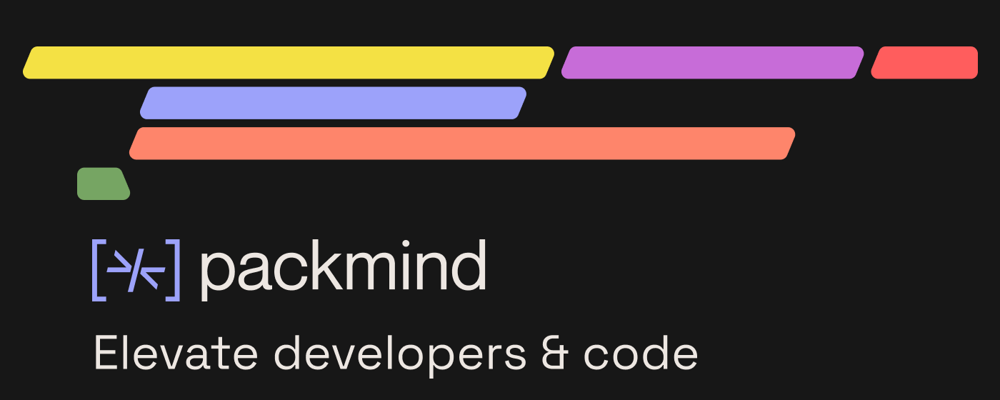

# Packmind Monorepo

[](https://github.com/packmindhub/packmind-helm-chart/actions/workflows/ci.yaml)
[](https://github.com/packmindhub/packmind-helm-chart/actions/workflows/release.yaml)

## Overview

Packmind is an innovative AI-powered knowledge management system designed to help individuals and organizations capture, organize, and retrieve information efficiently. This monorepo contains all the applications and services for the Packmind ecosystem, built with NX for efficient development and deployment.

## Architecture

### Applications

#### Frontend (`apps/frontend/`)
- **Technology**: Next.js 14 with TypeScript
- **Port**: 4200 (development)
- **Features**: React-based web interface with server-side rendering
- **Monitoring**: Sentry error tracking and performance monitoring

#### API Server (`apps/api/`)
- **Technology**: Node.js with Express and TypeScript
- **Port**: 3000
- **Features**: RESTful API with MongoDB integration
- **Monitoring**: Sentry error tracking and performance monitoring
- **Endpoints**: `/api/plugin`, `/api/suggestion`, `/health`

#### MCP Server (`apps/mcp-server/`)
- **Technology**: Node.js with Express and TypeScript
- **Port**: 3001
- **Features**: Model Context Protocol server
- **Monitoring**: Sentry error tracking and performance monitoring

### Key Features

- **AI-Powered Knowledge Capture**: Automatically extract and categorize information from various sources
- **Intelligent Search**: Find relevant information using natural language queries
- **Contextual Recommendations**: Get suggestions based on your current work and interests
- **Seamless Integration**: Works with popular productivity tools and platforms
- **Collaborative Knowledge Sharing**: Enable teams to build and maintain shared knowledge bases
- **Comprehensive Monitoring**: Sentry integration across all applications for error tracking and performance monitoring

## Technology Stack

- **Frontend**: Next.js 14, React 18, TypeScript
- **Backend**: Node.js, Express, TypeScript
- **Database**: MongoDB
- **Build System**: NX Monorepo
- **Monitoring**: Sentry
- **Package Manager**: npm

## Getting Started

### Prerequisites
- Node.js 18+
- npm 8+
- MongoDB (optional, for API server)

### Installation

1. Clone the repository
2. Install dependencies:
   ```bash
   npm install
   ```
3. Set up environment variables:
   ```bash
   cp .env.example .env
   # Edit .env with your configuration
   ```

### Development

```bash
# Run all applications
npm run dev

# Or run individually
nx serve frontend    # Frontend at http://localhost:4200
nx serve api        # API server at http://localhost:3000
nx serve mcp-server # MCP server at http://localhost:3001
```

### Production

```bash
# Build all applications
npm run build

# Run all applications
npm run start
```

### Testing

```bash
# Run all tests
npm run test

# Run tests for specific app
nx test frontend
nx test api
nx test mcp-server
```

## Sentry Integration

All applications are configured with Sentry for error tracking and performance monitoring. See [SENTRY_SETUP.md](SENTRY_SETUP.md) for detailed configuration instructions.

### Test Error Tracking
- Frontend: Visit `/` and click "Test Sentry Error"
- API: `GET /api/test-error`
- MCP Server: `GET /test-error`

## Project Structure

```
packmind-monorepo/
├── apps/
│   ├── frontend/          # Next.js frontend application
│   ├── api/              # Express API server
│   └── mcp-server/       # MCP protocol server
├── packages/             # Shared packages (future)
├── charts/               # Kubernetes Helm charts
├── docs/                 # Documentation
├── scripts/              # Build and deployment scripts
├── nx.json               # NX workspace configuration
├── package.json          # Root package.json
├── tsconfig.base.json    # Base TypeScript configuration
└── SENTRY_SETUP.md       # Sentry configuration guide
```

## NX Commands

```bash
# Generate new application
nx g @nx/next:app my-app

# Generate new library
nx g @nx/js:lib my-lib

# Run linting
nx lint

# View dependency graph
nx graph
```

## Helm Chart (Kubernetes Deployment)

This repository also includes Helm charts for deploying Packmind on Kubernetes clusters.

### Usage

[Helm](https://helm.sh) must be installed to use the charts. Please refer to Helm's [documentation](https://helm.sh/docs) to get started.

Once Helm has been set up correctly, add the repository:

```bash
helm repo add packmind https://packmindhub.github.io/packmind-helm-chart
```

### MongoDB Configuration

You have 2 options to deal with MongoDB:

#### 1. Use the embedded MongoDB 6.x

Setting the `app.databaseEmbedded.enabled` at `true` will run a MongoDB instance in the cluster.

#### 2. Use your instance MongoDB 6.x

Setting the `app.databaseEmbedded.enabled` at `false` will require you to indicate the URI of your MongoDB instance.

### Run the chart

To install the chart:

```bash
helm upgrade --install packmind packmind/packmind --create-namespace --namespace packmind
```

To uninstall the chart and clean-up the cluster:

```bash
helm delete packmind
kubectl delete ns packmind
```

## Contributing

We welcome contributions! Please see our [Contributing Guide](docs/CONTRIBUTING.md) for details on how to get started.

## License

This project is licensed under the MIT License - see the [LICENSE](LICENSE) file for details.
